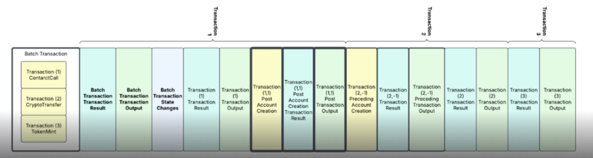

# HIP-551 Batch Transactions

## Purpose

[HIP-551](https://hips.hedera.com/hip/hip-551) adds the ability to submit batched transactions to the network.
This document details how the mirror node will be updated to support it.

## Goals

- Store relevant batch transaction information in the database
- Enhance the REST api for easy retrieval of batch transactions along with their inner transactions

## Architecture

### Database

#### Transaction

```postgresql
alter table if exists transaction
  add column if not exists batch_key          bytea      default null,
  add column if not exists inner_transactions bigint[] default null;
```

### Importer

Update

```java
public enum TransactionType {
    ATOMIC_BATCH(74, EntityOperation.NONE)
}
```

Update

```java
public class Transaction {
  private byte[] batchKey;
  private List<Long> innerTransactions;

  public void addInnerTransaction(Transaction transaction) {
    if (innerTransactions == null) {
      innerTransactions = new ArrayList<>();
    }

    innerTransactions.add(transaction.getPayerAccountId().getId());
    innerTransactions.add(transaction.getValidStartNs());
  }
}
```

Update

```java
public class EntityRecordItemListener implements RecordItemListener {
    private Transaction buildTransaction(EntityId entityId, RecordItem recordItem) {
        if (body.hasBatchKey()) {
          transaction.setBatchKey(body.getBatchKey());
        }
    }
}
```

Update

```java
public class SqlEntityListener implements EntityListener, RecordStreamFileListener {
  @Override
  public void onTransaction(Transaction transaction) throws ImporterException {
    context.add(transaction);

    if (transaction.getBatchKey() != null && transaction.getNonce() == 0) {
      Transaction batchParent = context.get(Transaction.class, transaction.getParentConsensus());

      if (batchParent == null) {
        throw new ImporterException("Batch parent not found for transaction: " + transaction.getConsensusTimestamp());
      }
      batchParent.addInnerTransaction(transaction);
    }
    // ...continue with current logic
  }
}
```

Update

```java
public class BlockItem {
  private final TransactionBody transactionBody;
  private final SignatureMap signatureMap;

  public static class BlockItemBuilder {
    public BlockItem build () {
      if (transactionBody == null || signatureMap == null) {
        parseBody();
      }
      return new BlockItem(
              transaction,
              transactionResult,
              transactionOutputs,
              stateChanges,
              previous,
              transactionBody,
              signatureMap);
    }
    private void parseBody() {
      // Move logic from BlockItemTransformerFactory.java parse
    }
  }
}
```

Update

```java
public class RecordItem {
  private void parseTransaction() {
    if (transactionBody == null || signatureMap == null) {
      // do current logic
    }
  }
}
```

Update

```java
public class BlockFileTransformer {
    private List<RecordItem> getRecordItems() {
      // Update built record items to
      RecordItem.builder()
              .hapiVersion(hapiVersion)
              .signatureMap(blockTransaction.getSignatureMap())
              .transaction(blockTransaction.getTransaction())
              .transactionBody(blockTransaction.getTransactionBody())
              .transactionIndex(index);
    }
}
```

Update

```pseudo
public class ProtoBlockFileReader implements BlockFileReader {
    private void readEventTransactions(ReaderContext context) {
      While transaction = context.getSignedTransaction() != null)
        CURRENT LOGIC
      End While
    }

    private static class ReaderContext {
      private int batchInnerIndex;
      private AtomicBatchTransactionBody atomicBatchTransactionBody;

      public void setLastBlockTransaction(BlockTransaction blockTransaction) {
        this.lastBlockTransaction = blockTransaction;
        if (blockTransaction.getTransactionBody().hasAtomicBatchBody()) {
          this.atomicBatchTransactionBody = blockTransaction.getTransactionBody().getAtomicBatchBody();
          this.batchInnerIndex = 0;
        }
      }

      public byte[] getSignedTransaction() {
          Read signed transaction block item
          If present
             return signed transacion bytes
          Else If atomicBatchTransactionBody is not null && batchInnerIndex < atomicBatchTransactionBody.getTransactionsList().size()
            return signed transaction bytes from atomicBatchTransactionBody.getTransactionsList().get(batchInnerIndex++)
          Else
            Return null
      }
  }
}
```

#### Block Stream Representation



- Record streams can use `UnknownDataTransactionHandler.java` for batch transactions
- Block streams can use `DefaultTransformer.java` for batch transactions

### REST API

#### Transactions

- Change `transaction.js` constructor to add `batch_key` and `inner_transactions`
- Include `batch_key` in transaction response
  - Change `Transactions.formatTransactionRows` to include the `batch_key`
  ```json
  {
    "transactions": [
      {
        "batch_key": {
          "_type": "ED25519",
          "key": "84e9575e7c9c3f5c553fb4c54e5dc408e41a1d58c12388bea37d7d7365320f6f"
        }
      }
    ]
  }
  ```
- Update `Transactions.getTransactionsByIdOrHash` to query all `payer_account_id` and `valid_start_ns` combinations
  contained in `transaction.inner_transactions` for transaction(s) matching the `transactionId`

```pseudo
const getTransactionsByIdOrHash = async (req, res) => {
  If request by transactionId
    Get Transactions by transactionId using current logic
    If scheduled query param is NOT true
      For each transaction in result
        Collect innerTransactions
      If innerTransactions is not empty
        Using initial requestFilters, query for all inner transactions
      If order is asc
        append inner transactions to current result
      Else
        prepend inner transactions to current result
  Use existing result handling
};
```

- Update `transactionResult.js` to include new response codes

```psudo
/**
* The list of batch transactions is empty
*/
BATCH_LIST_EMPTY

/**
* The list of batch transactions contains duplicated transactions
*/
BATCH_LIST_CONTAINS_DUPLICATES

/**
* The list of batch transactions contains null values
*/
BATCH_LIST_CONTAINS_NULL_VALUES

/**
* An inner transaction within the batch failed
*/
INNER_TRANSACTION_FAILED
```

### Acceptance Test Scenarios

- Submit a batch transaction with inner transaction producing hollow create AND child transactions

## Non-Functional Requirements

- The mirror node should be able to handle batch transactions with minimal performance impact on ingest
- Retrieving transactions by transaction id should have no performance impact for non batch transactions and minimal
  performance impact for batch transactions

## Rejected Ideas

- Store inner transactions (with all transaction columns) in a separate table with additional column for batch payer.
  This would allow colocating inner transactions with their batch parent, but would require additional
  storage for duplicated data. Only downside to not taking this approach is additional query overhead when
  retrieving batch transactions by transaction id.
- Store inner transactions as a jsonb column on transaction with array of payer account and valid start. This approach
  was rejected due to potential bloat from using jsonb data type.

## Open Questions

- Can block streams remove duplication of inner transaction bytes?
