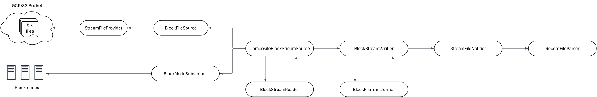

# HIP-1081 Block Node

## Purpose

[HIP-1081](https://hips.hedera.com/hip/hip-1081) introduces block node, a new node type that is designed to parse the block stream, store latest state
and serve up additional network APIs such as state proofs and block retrieval that support decentralized querying
and verification of state.

This design document concerns the support of streaming blocks from block nodes in mirror nodes.

## Goals

- Support streaming blocks from block nodes
- Support automatically switching the source from cloud storage to block nodes

## Non-Goals

- Removal of downloading block stream files from cloud storage
- Retrieve a state snapshot and bootstrap

## Architecture

### Database

Since block nodes don't have a node id, the `not null` constraint of the `node_id` column in `record_file` table needs
to be dropped. Note the column can be dropped after sunsetting stateproof alpha API.

For blocks streamed from block nodes, it's an expensive operation to get the serialized protobuf message size given
there can be tens of thousands block items in a block. As a result, there won't be `size` info, and the `size` column
will have `null` value.

```sql
alter table if exists record_file alter column node_id drop not null;
```

### Data Flow



Note: The diagram amends the block streams data flow with block node support

## Importer

- Add new configuration properties to `BlockStreamProperties` to support block nodes
- Replace interface `StreamPoller` with `BlockStreamSource`
- Add an abstract class `AbstractBlockStreamSource`
- Move block file downloading in `BlockStreamPoller` to a new class `BlockFileSource`
- Add new class `BlockNodeSubscriber` to support streaming blocks from block nodes
- Rename `BlockFileReader` to `BlockStreamReader`, and `ProtoBlockFileReader` to `ProtoBlockStreamReader`

### Interfaces and Classes

### BlockNodeProperties

```java
public class BlockNodeProperties {
    private String host;
    private int port;
    private int priority;
}
```

When picking a block node to stream block items from, a block node with higher `priority` is always tried first. Block
nodes with the same `priority` are tried with the order in the configuration. `priority` can't be negative and 0 is the
highest.

### BlockSourceType

```java
public enum BlockSourceType {
    AUTO,
    BLOCK_NODE,
    FILE
}
```

See [`CompositeBlockStreamSource`](#CompositeBlockStreamSource) for how `AUTO` works.

### BlockStreamProperties

```java
public class BlockStreamProperties {
    ...
    private Collection<BlockNodeProperties> nodes = Collections.emptyList();
    private BlockSourceType sourceType = BlockSourceType.AUTO;
}
```

This is renamed from `BlockPollerProperties`, with two new properties added.

### BlockStream

```java
public record BlockStream(List<BlockItem> blockItems, byte[] bytes, String filename, long loadStart, Long nodeId) {}
```

`BlockStream` represents a block from a downloaded block file, or a block streamed from a block node. The `filename`
is the downloaded block file's name, or generated from the block number with `.blk` suffix. `nodeId` indicates which
node the block file is downloaded from, or `null` if data is streamed from a block node.

### BlockStreamReader

```java
public interface BlockStreamReader {
    BlockFile read(BlockStream blockStream);
}
```

Renamed from `BlockFileReader`. Note the interface no longer extends `StreamFileReader` because it now reads
a `BlockStream` instead of a `StreamFileData`.

### BlockStreamSource

```java

public interface BlockStreamSource {
  /*
   * Gets block streams from the source. An implementation can either download block streams from cloud storage, or
   * stream block streams from a block node.
   */
  void get();
}
```

This replaces interface `StreamPoller` since poll is an incorrect term when the implementation streams data pushed from
server.

### AbstractBlockStreamSource

```java
abstract class AbstractBlockStreamSource implements BlockStreamSource {

    protected final long getNextBlockNumber();

    protected final void onBlockStream(BlockStream blockStream) {
        read block stream;
        verify block stream;
    }
}
```

### BlockFileSource

```java
final class BlockFileSource extends AbstractBlockStreamSource {

    @Override
    public void get() {
        call getNextBlockNumber;
        for each node
            try
                download the block file from the node
                call onBlockStream
                return
            catch error and continue to next node
    }
}
```

`BlockFileSource` polls a block file using `StreamFileProvider`, and calls `AbstractBlockStreamSource.onBlockStream`.

### BlockNodeSubscriber

```java
final class BlockNodeSubscriber extends AbstractBlockStreamSource {

    @Override
    public void get() {
        call getNextBlockNumber;
        call serverStatus to find the first block node with the next block;
        throw error if no block node has the next block;

        subscribe to the selected block node to stream blocks;
        for block items received from the subscription
          append block items to previous received block items
          if the last block item is a BlockProof
            call onBlockStream;
          else if the last and only block item is a RecordFileItem
            call onBlockStream;
    }
}
```

`BlockNodeSubscriber` streams blocks from a list of block nodes in round-robin starting from the first node in the
configuration. At any time, `BlockNodeSubscriber` should only communicate with one block node. `BlockNodeSubscriber`
should set a timeout while waiting for block items of a block to complete. Upon any error during streaming and block
processing, `BlockNodeSubscriber` should clean up resources created for the connection with the block node and throw
exception so `CompositeBlockStreamSource` can maintain health status, and have `BlockNodeSubscriber` try the next block
node, or even switch to `BlockFileSource` if needed.

`BlockNodeSubscriber` should call `serverStatus` RPC to determine if a block node can provide a block before start
streaming and fail fast if none of the block nodes have the next block.

It's possible that a streaming response from a block node only contains part of a block, `BlockNodeSubscriber` needs to
combine block items in the same block and only then calls `onBlockStream`. Note that a streaming response from the block
node would never have block items from two blocks mixed, i.e., to determine if the block items in the response completes
a block, simply check if the last block item is a `BlockProof`.

### CompositeBlockStreamSource

```java
public class CompositeBlockStreamSource implements BlockStreamSource {

    @Override
    public void get();
}
```

It delegates to either `BlockFileSource` or `BlockNodeSubscriber` to get blocks, depending on the configuration and the
delegates' health.

`AUTO` source type supports automatically switching from cloud storage to block nodes and continuing streaming from
block nodes across importer restarts once the switch happens:

- when there is no block nodes configured, get block files using `BlockFileSource`
- when there is no record file or block file downloaded, use `BlockNodeSubscriber` first
- when one source is unhealthy, e.g., it fails to download one block 5 times consecutively, switch to the other source
- once a block is streamed from a block node and validated, change to always use `BlockNodeSubscriber`, even when
  `BlockNodeSubscriber` fails to stream blocks consistently. This can be determined by checking if the filename of the
  last validated block file ends with `.blk` or not. Note the last validated block file can be either cached in memory
  or read from `record_file` table
